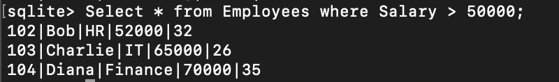
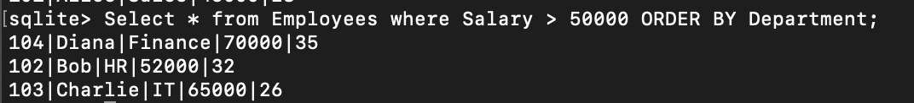
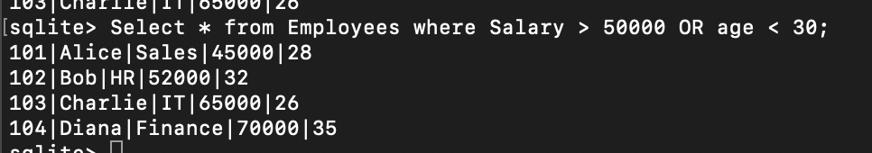

# TASK 2: Basic Filtering and Sorting

## a) Use the WHERE clause to filter records based on a condition (e.g., WHERE Department = 'Sales').

### Query:

```
Select * from Employees where Salary > 50000;
```



## b) Apply the ORDER BY clause to sort the results (e.g., by LastName or Salary).

### Query:

```
Select * from Employees where Salary > 50000 ORDER BY Department;
```



## c) Experiment with multiple conditions using AND/OR.

### Query:

#### AND:

```
Select * from Employees where Salary > 50000 AND age < 30;
```


#### OR:

```
Select * from Employees where Salary > 50000 OR age < 30;
```


