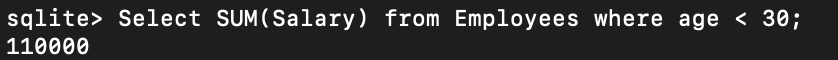
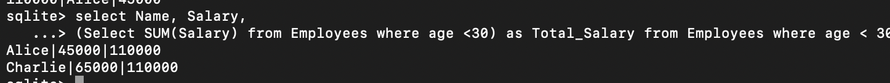
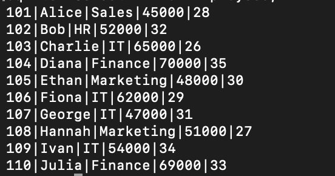
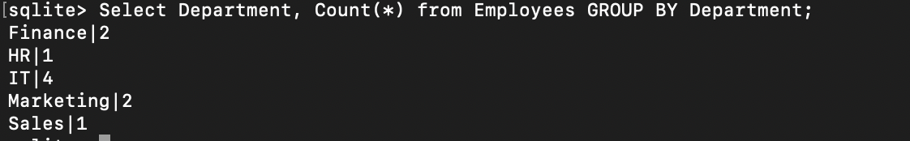

# TASK 3: Simple Aggregation and Grouping

## a) Write a query that uses aggregate functions such as COUNT(), SUM(), or AVG() to calculate totals or averages.

### COUNT:

```
Select COUNT(*) from Employees;
```


### SUM:

```
Select SUM(Salary) from Employees where age < 30;
```



Verifying if the SUM matches with the data in the table

```
select Name, Salary,
(Select SUM(Salary) from Employees where age <30) as Total_Salary from Employees where age < 30;
```



### AVG:

```
Select AVG(Salary) from Employees;
```


## b) Use the GROUP BY clause to aggregate data by a specific column (e.g., count the number of employees per department).

### Adding additional rows to the table:

```

INSERT into Employees VALUES
(106, 'Fiona', 'IT', 62000, 29),
(107, 'George', 'IT', 47000, 31),
108, 'Hannah', 'Marketing', 51000, 27),
(109, 'Ivan', 'IT', 54000, 34),
(110, 'Julia', 'Finance', 69000, 33);
```

### New Table:



### Group by clause:

```
Select Department, Count(*) from Employees GROUP BY Department;
```



## c) Optionally, filter grouped results using the HAVING clause.

### Query:

```
Select Department, Count(*) from Employees
GROUP BY Department
HAVING Count(*) > 1;
```


