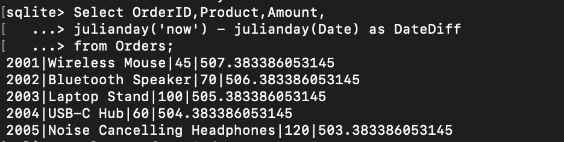
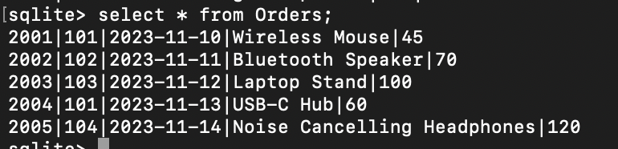
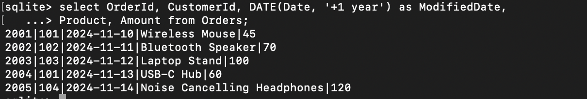
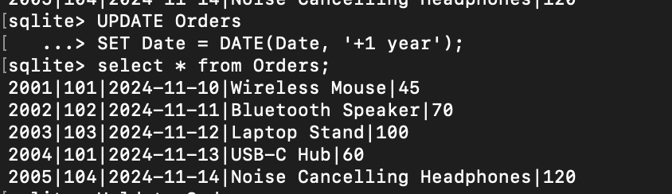
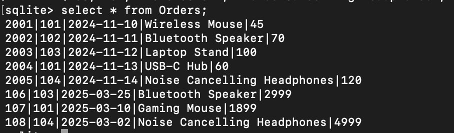
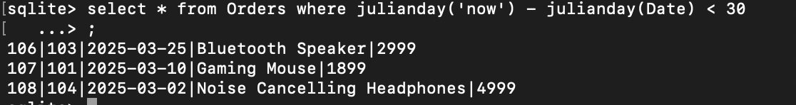
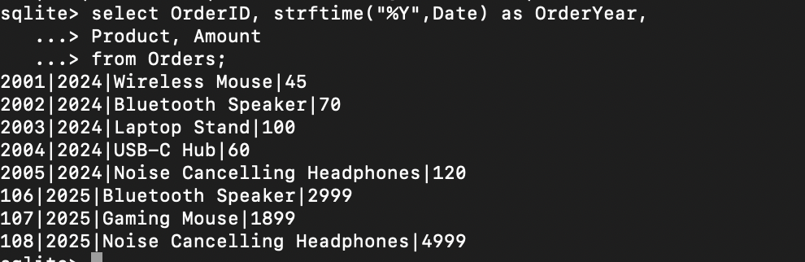

# TASK 6: Date and Time Functions

## a) Use built-in date functions (e.g., DATEDIFF, DATEADD, or your SQL dialect’s equivalent) to calculate intervals or adjust dates.

### DATEDIFF:

```
Select OrderID,Product,Amount,
julianday('now') - julianday(Date) as DateDiff
from Orders;
```



### DATEADD:

```
select OrderId, CustomerId, DATE(Date, '+1 year') as ModifiedDate,
Product, Amount from Orders;
```

#### Previous table:



#### Dateadd:



### Updating orders + adding extra data

```
UPDATE Orders
SET Date = DATE(Date, '+1 year');
```



```
INSERT INTO Orders VALUES
(106, 103, '2025-03-25', 'Bluetooth Speaker', 2999),
(107, 101, '2025-03-10', 'Gaming Mouse', 1899),
(108, 104, '2025-03-02', 'Noise Cancelling Headphones', 4999);
```



## b) Write a query to filter records based on date ranges (e.g., orders placed within the last 30 days).

```
select * from Orders where julianday('now') - julianday(Date) < 30;
```



## c) Format date outputs if necessary using functions like CONVERT or TO_CHAR.

```
select OrderID, strftime("%Y",Date) as OrderYear,
Product, Amount
from Orders;
```


