# TASK 10: Comprehensive Database Design, Optimization, and Advanced Features

## a) Design and create multiple related tables (e.g., Products, Customers, Orders, OrderDetails) with proper primary and foreign keys, unique constraints, and normalization practices.

### Customers Table

#### Creation and Insertion

```
CREATE table Customers(
    CustomerID INT(1) PRIMARY KEY,
    Name varchar(50),
    Email varchar(20),
    Phone varchar(15),
    City varchar(30)
    );

```

```
INSERT into Customers VALUES
    (1, 'Alice', 'alice@mail.com', '1234567890', 'New York'),
    (2, 'Bob', 'bob@mail.com', '2345678901', 'Chicago'),
    (3, 'Charlie', 'charlie@mail.com', '3456789012', 'Los Angeles'),
    (4, 'Diana', 'diana@mail.com', '4567890123', 'Seattle'),
    (5, 'Ethan', 'ethan@mail.com', '5678901234', 'Houston'),
    (6, 'Fiona', 'fiona@mail.com', '6789012345', 'Boston'),
    (7, 'George', 'george@mail.com', '7890123456', 'Phoenix');
```

#### Creating table CITIES to ensure 2NF:

```
CREATE table CITIES(
    CityID INT(3) PRIMARY KEY,
    CityName varchar(30)
    );
```

```

INSERT into CITIES VALUES
    (1, 'New York'),
    (2, 'Chicago'),
    (3, 'Los Angeles'),
    (4, 'Seattle'),
    (5, 'Houston'),
    (6, 'Boston'),
    (7, 'Phoenix');
```

#### Cities data:

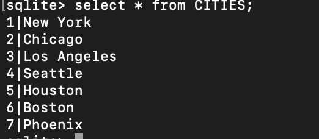

#### Updating customers table to account for CityID, not CityName

```
ALTER TABLE Customers
    ADD column CityID INT(3) REFERENCES CITIES(CityID);
```

```
UPDATE Customers SET CityID = 1 WHERE City = 'New York';
UPDATE Customers SET CityID = 2 WHERE City = 'Chicago';
UPDATE Customers SET CityID = 3 WHERE City = 'Los Angeles';
UPDATE Customers SET CityID = 4 WHERE City = 'Seattle';
UPDATE Customers SET CityID = 5 WHERE City = 'Houston';
UPDATE Customers SET CityID = 6 WHERE City = 'Boston';
UPDATE Customers SET CityID = 7 WHERE City = 'Phoenix';
```

```
ALTER TABLE Customers DROP City;
```

#### Customers Table in 2NF + SCHEMA

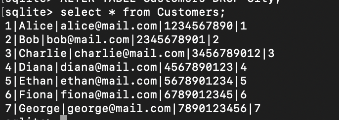 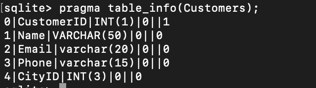

### Products Table

```
CREATE table Products(
    ProductID INT(3) PRIMARY KEY,
    Name varchar(30),
    Price int(5),
    Stock int(5)
    );
```

```
INSERT into Products VALUES
    (101, 'Keyboard', 500, 40),
    (102, 'Mouse', 300, 60),
    (103, 'Monitor', 8000, 20),
    (104, 'Webcam', 1200, 30),
    (105, 'Laptop Stand', 900, 25),
    (106, 'USB Hub', 650, 50),
    (107, 'Desk Lamp', 1100, 15);
```

#### Product table data + SCHEMA

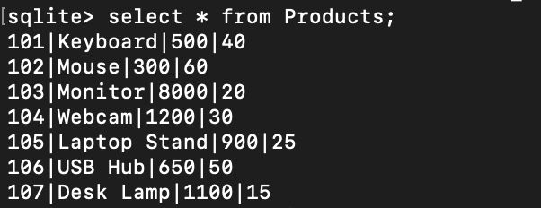 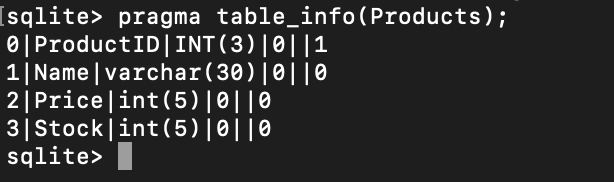

### Orders Table:

```
CREATE table Orders(
    OrderID INT(3) PRIMARY KEY,
    CustomerID INT(1) REFERENCES Customers(CustomerID),
    OrderDate DATE
    );
```

```
INSERT into Orders VALUES
    (201, 1, '2024-03-01'),
    (202, 2, '2024-03-02'),
    (203, 3, '2024-03-03'),
    (204, 4, '2024-03-04'),
    (205, 5, '2024-03-05'),
    (206, 6, '2024-03-06'),
    (207, 7, '2024-03-07');
```

#### Orders Table data + SCHEMA:

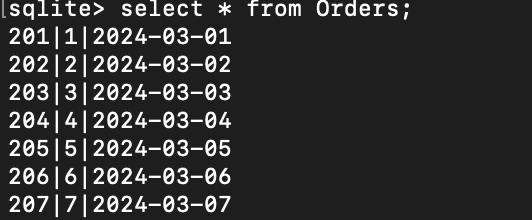 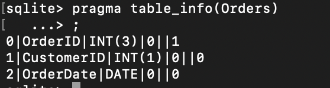

### Order Details Table:

```
CREATE table OrderDetails(
    OrderID INT(3) REFERENCES Orders(OrderID),
    ProductID INT(3) REFERENCES Products(ProductID),
    Quantity INT(5),
    TotalPrice INT(8)
    );
```

```
INSERT into OrderDetails VALUES
    (201, 101, 2, 1000),
    (201, 102, 1, 300),
    (202, 103, 1, 8000),
    (203, 104, 2, 2400),
    (204, 105, 1, 900),
    (205, 106, 3, 1950),
    (206, 107, 1, 1100);

```

#### Adding multi-attribute Primary Key to satisfy 3NF (no transitive property of attributes on non-key attributes)

```
ALTER TABLE OrderDetails
    ADD CONSTRAINT PK_Order PRIMARY KEY (OrderID, ProductID);
```

#### Order Details data + SCHEMA

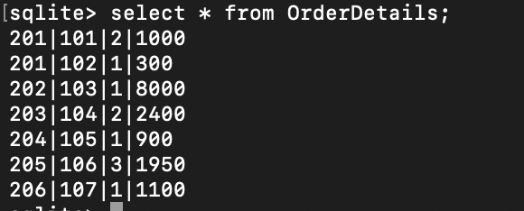 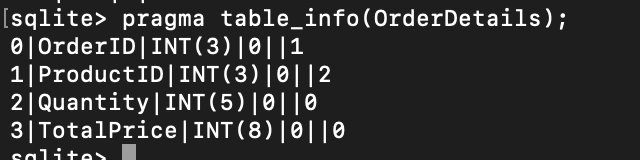

## b) Analyze query performance and apply indexing strategies to optimize frequently executed queries.

### INDEX 1: Creating an index on Customers to ensure no repeating emails:

```
CREATE UNIQUE INDEX customer_email
    ON Customers(Email);
```

#### Verifying if index is called on insertion

```
INSERT into Customers VALUES
    (8,'Aditi','alice@mail.com',7634527893,2);
```

#### Output on insertion:


### INDEX 2: Creating an index on a foreign key to speed up JOIN operations:

```
CREATE UNIQUE INDEX orderdetails_pid_index ON OrderDetails(ProductID);
```

#### Verifying if the index is called:

```
EXPLAIN QUERY PLAN
    SELECT od.OrderID, p.ProductID, p.Name, od.Quantity
    from OrderDetails od
    JOIN Products p
    ON od.ProductID = p.ProductID
    WHERE p.Name = 'Keyboard';
```

#### Output:

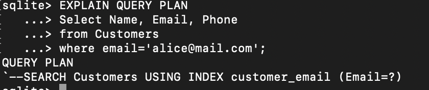

#### Query w/ index vs w/o index:

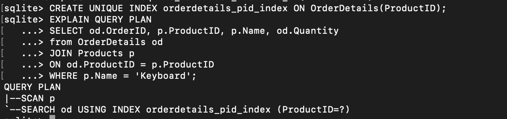 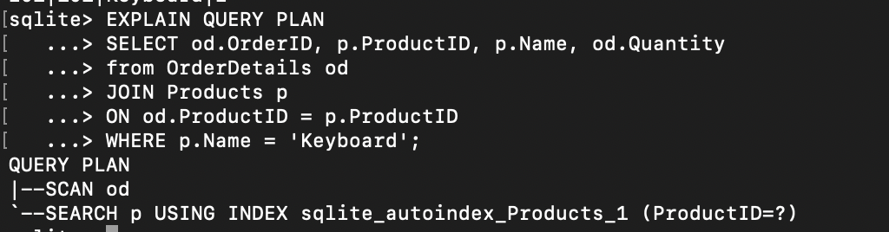

## c) Implement triggers to enforce business rules automatically (e.g., update inventory levels upon order insertion, log changes to critical tables).

### TRIGGER 1: Trigger to update TotalPrice in OrderDetails whenever Price in Products changes. - UPDATE TRIGGER

```
CREATE TRIGGER update_od_price UPDATE OF Price on Products
BEGIN
UPDATE OrderDetails SET TotalPrice = Quantity*new.Price WHERE ProductID = old.ProductID;
END;
```

#### Update statement to see if trigger is called:

```
UPDATE Products SET Price = 1000 WHERE ProductID=101;
```

#### Output before trigger vs after

##### Products:

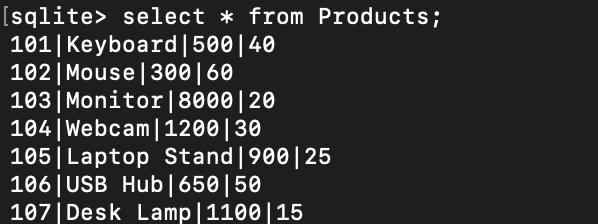 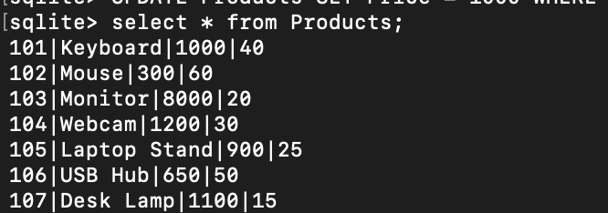

##### OrderDetails:

 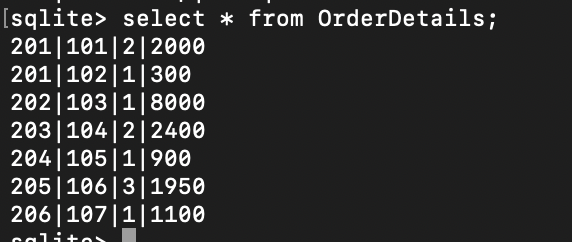

### TRIGGER 2: Ensuring TotalPrice = Quantity \* Price - INSERTION TRIGGER

```
    CREATE TRIGGER validate_total_price
    BEFORE INSERT ON OrderDetails
    BEGIN
    SELECT
    CASE
    WHEN new.TotalPrice != (SELECT Price from Products where ProductID = new.ProductID) * new.Quantity
    THEN RAISE(ABORT, 'TotalPrice does not match Quantity x Price')
    END;
    END;


```

#### Checking with an invalid insertion:

````
INSERT INTO OrderDetails VALUES
    (201,103,1,5000);
    ```
````

#### Output:


## d) Use transactions (BEGIN TRANSACTION, COMMIT, and ROLLBACK) to ensure data consistency during multi-step operations (e.g., order processing where multiple tables are updated).

### Transaction - w/ commit

```
BEGIN TRANSACTION;
UPDATE Products SET Price = Price + 10;
COMMIT;
```

#### Output: commit

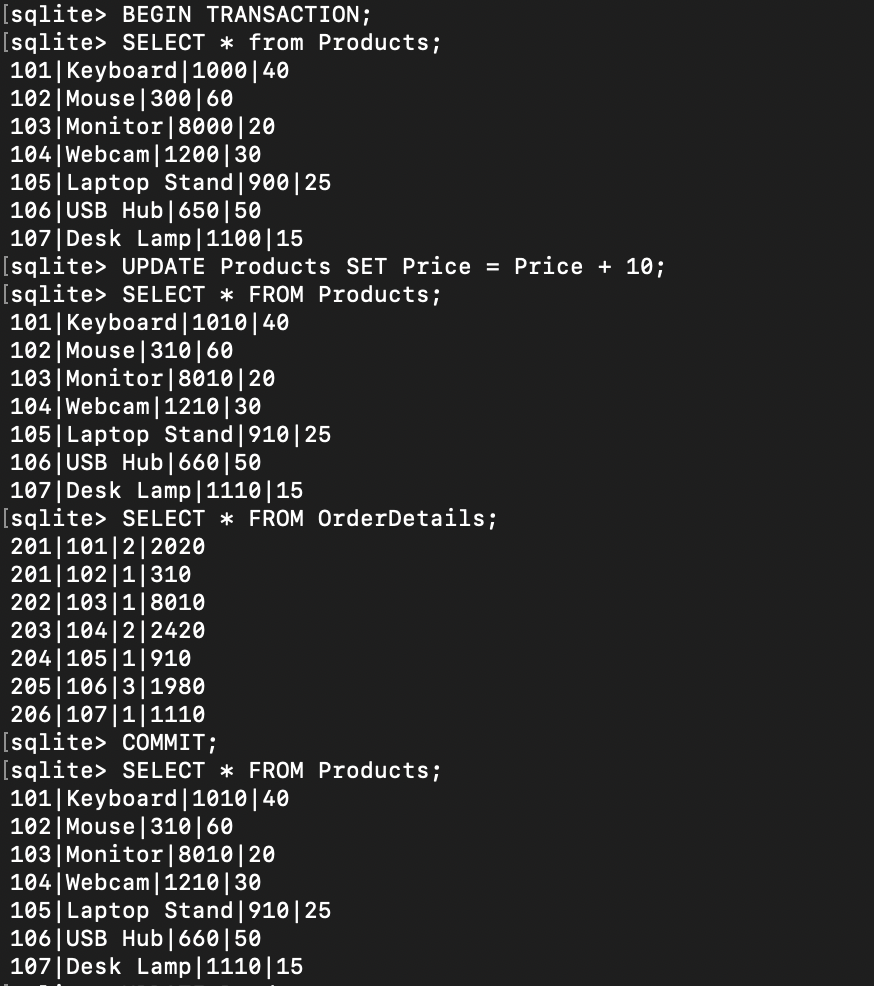

### Transaction - w/ rollback

```
BEGIN TRANSACTION;
UPDATE Products
    SET Stock = Stock - 20;

ROLLBACK;
```

#### Output: rollback

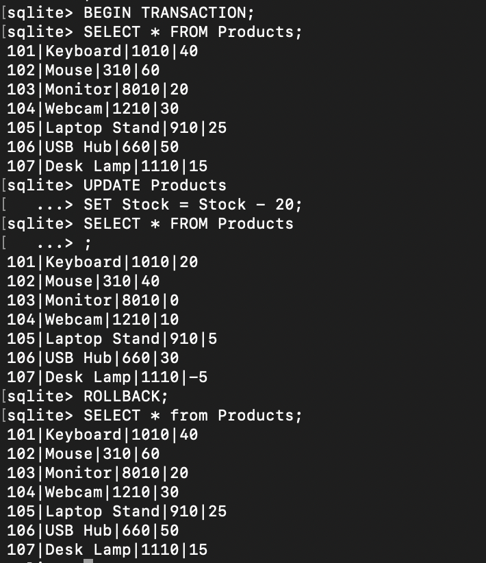

## e) Create views to simplify complex joins and aggregations.

### Creating views to simplify multiple JOINS

```
CREATE TEMP VIEW total_customer_details AS
SELECT
    c.CustomerID,
    c.Name,
    c.Email,
    c.Phone,
    ci.CityName,
    o.OrderID,
    od.ProductID,
    p.Name AS ProductName,
    od.TotalPrice,
    o.OrderDate
FROM Customers c
JOIN Cities ci ON c.CityID = ci.CityID
JOIN Orders o ON c.CustomerID = o.CustomerID
JOIN OrderDetails od ON od.OrderID = o.OrderID
JOIN Products p ON od.ProductID = p.ProductID;
```

#### Output:

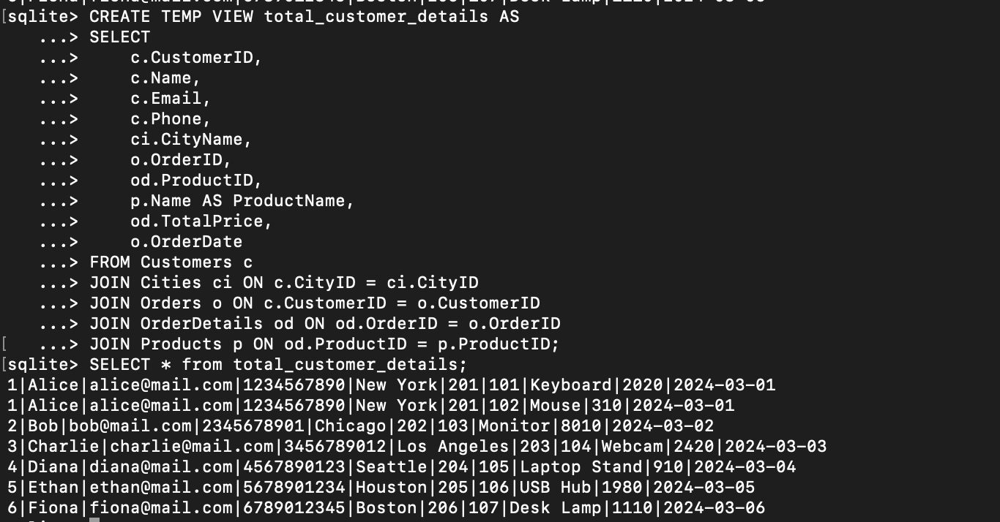
