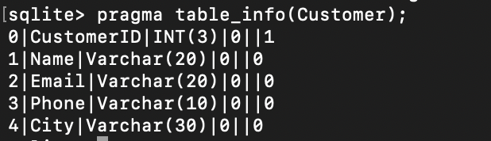
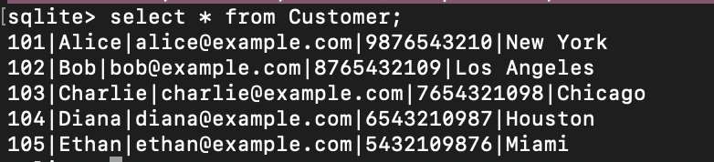
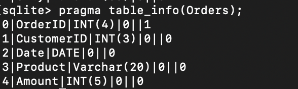
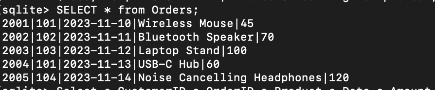
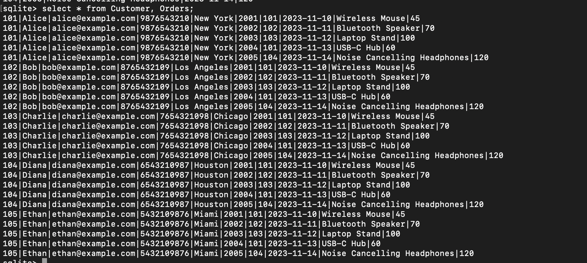
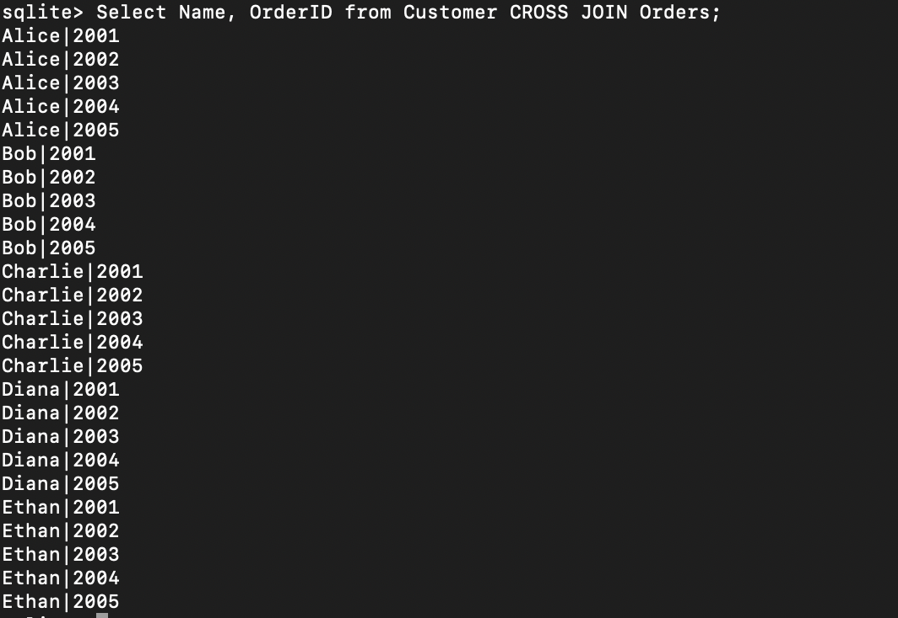
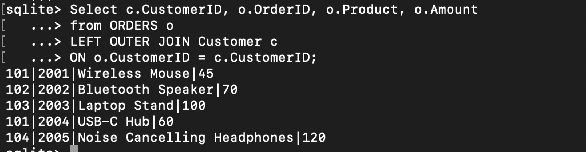

# TASK 4: Multi-Table JOINS

## a) Create two related tables (e.g., Customers and Orders) with a foreign key relationship.

### Customer Table:

```
CREATE TABLE Customer(CustomerID INT(3) PRIMARY KEY,
Name Varchar(20),
Email Varchar(20),
Phone Varchar(10),
City Varchar(30));
```

```
INSERT INTO Customer VALUES
(101, 'Alice', 'alice@example.com', '9876543210', 'New York'),
(102, 'Bob', 'bob@example.com', '8765432109', 'Los Angeles'),
(103, 'Charlie', 'charlie@example.com', '7654321098', 'Chicago'),
(104, 'Diana', 'diana@example.com', '6543210987', 'Houston'),
(105, 'Ethan', 'ethan@example.com', '5432109876', 'Miami');
```

Schema:


Values:


### Orders Table:

```
CREATE TABLE Orders(OrderID INT(4) PRIMARY KEY,
CustomerID INT(3) REFERENCES Customer(CustomerID),
Date DATE,
Product Varchar(20),
Amount INT(5));
```

```
INSERT INTO Orders VALUES
(2001, 101, '2023-11-10', 'Wireless Mouse', 45),
(2002, 102, '2023-11-11', 'Bluetooth Speaker', 70),
(2003, 103, '2023-11-12', 'Laptop Stand', 100),
(2004, 101, '2023-11-13', 'USB-C Hub', 60),
(2005, 104, '2023-11-14', 'Noise Cancelling Headphones', 120);
```

Schema:


Values:


## b) Write an INNER JOIN query to retrieve combined information (e.g., customer names along with their order details).

### Query:

```
Select c.CustomerID, o.OrderID, o.Product, o.Date, o.Amount
from Customer as c
INNER JOIN Orders as o
ON c.CustomerID = o.CustomerID;
```

OR

```
Select CustomerID, OrderID, Product,Date,Amount
from Customer
NATURAL JOIN Orders;
```


## c) Experiment with other types of joins such as LEFT JOIN to understand how missing matches are handled.

### Cross join:

```
select * from Customer, Orders;
```



```
Select Name, OrderID from Customer CROSS JOIN Orders;
```



### Left Join:

```
Select c.CustomerID, o.OrderID, o.Product, o.Amount
from CUSTOMER c
LEFT OUTER JOIN Orders o
ON c.CustomerID = o.CustomerID;
```


```
Select c.CustomerID, o.OrderID, o.Product, o.Amount
from ORDERS o
LEFT OUTER JOIN Customer c
ON o.CustomerID = c.CustomerID;
```


