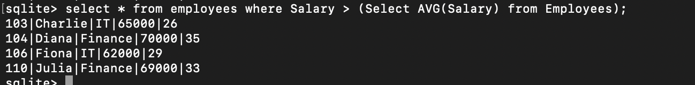
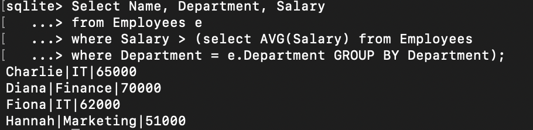
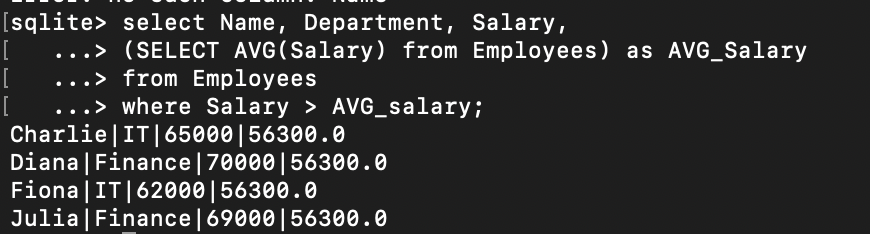
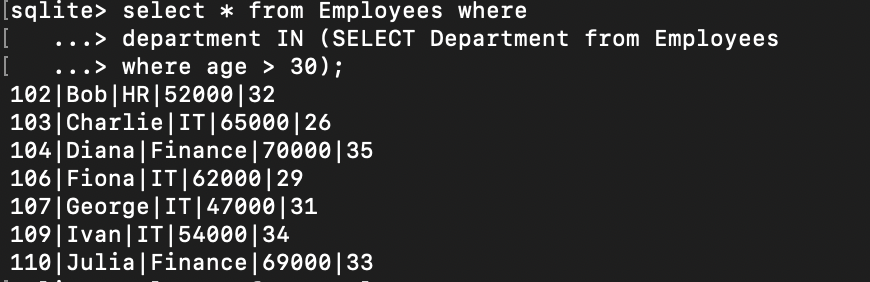

# TASK 5: Subqueries and Nested Queries

## a) Write a query that uses a subquery in the WHERE clause (e.g., select employees whose salary is above the department’s average salary).

### Query:

```
select * from employees where Salary > (Select AVG(Salary) from Employees);
```



```
Select Name, Department, Salary
from Employees e
where Salary > (select AVG(Salary) from Employees
where Department = e.Department GROUP BY Department);
```



## b) Alternatively, use subqueries in the SELECT list to compute dynamic columns.

### Query:

```
select Name, Department, Salary,
(SELECT AVG(Salary) from Employees) as AVG_Salary
from Employees
where Salary > AVG_salary;
```



## c) Understand the difference between correlated and non-correlated subqueries.

### Query:- Non correlated query

```
select * from Employees where
department IN (SELECT Department from Employees
where age > 30);
```


