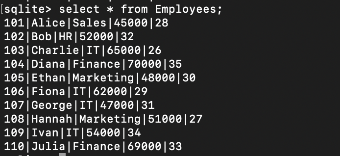
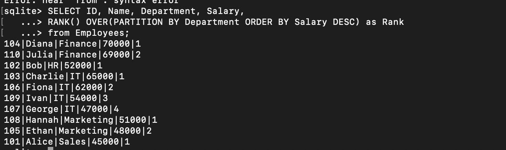
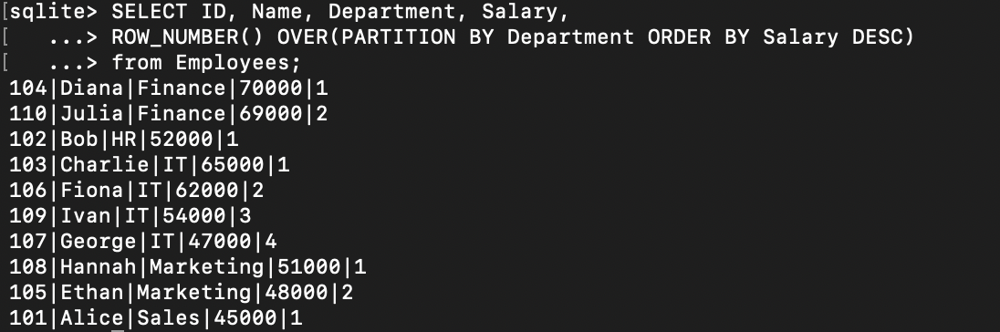
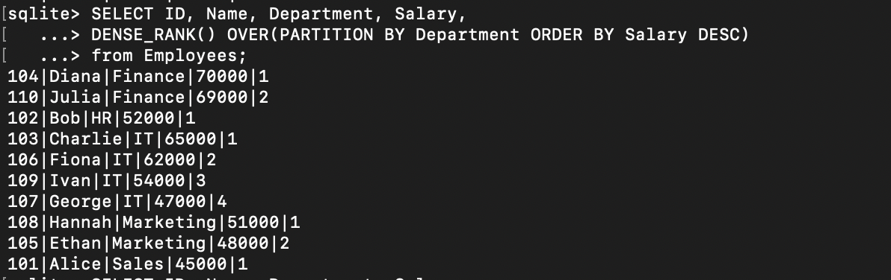
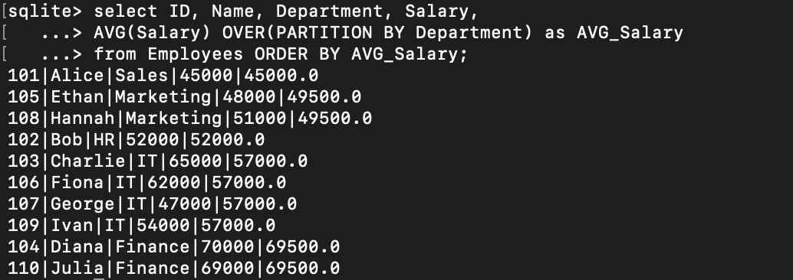
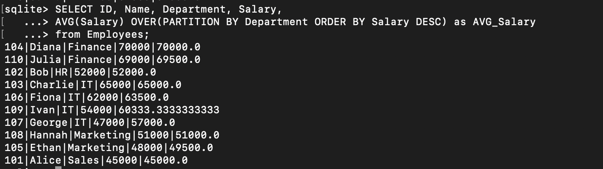
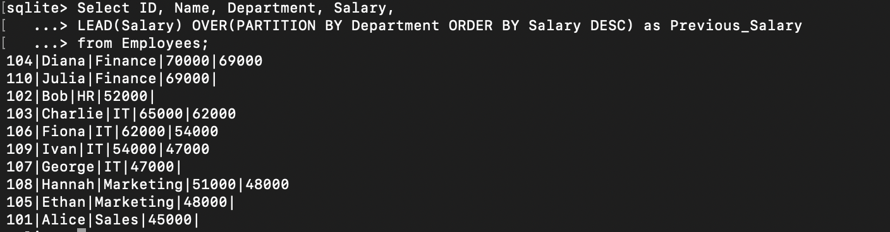
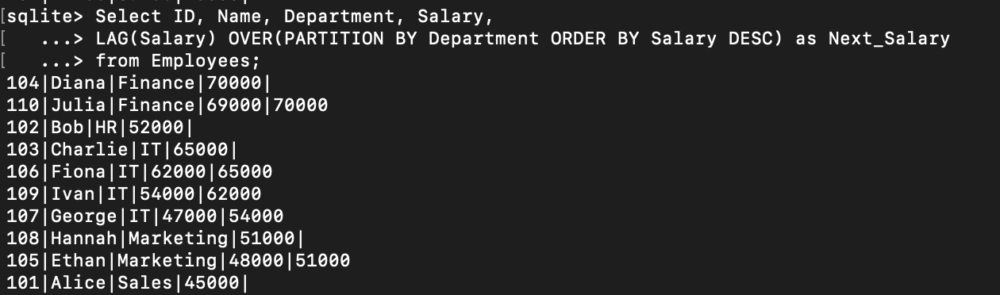

# TASK 7: Window Functions and Ranking

### Employees table(for reference):



## a) Write a query using window functions such as ROW_NUMBER(), RANK(), or DENSE_RANK() to assign ranks (e.g., rank employees by salary within each department).

### RANK:

```
SELECT ID, Name, Department, Salary,
RANK() OVER(PARTITION BY Department ORDER BY Salary DESC) as Rank
from Employees;
```



### ROW_NUMBER:

```
SELECT ID, Name, Department, Salary,
ROW_NUMBER() OVER(PARTITION BY Department ORDER BY Salary DESC)
from Employees;
```



### DENSE_RANK:

```
SELECT ID, Name, Department, Salary,
DENSE_RANK() OVER(PARTITION BY Department ORDER BY Salary DESC)
from Employees;
```



## b) Use PARTITION BY to define groups and ORDER BY to specify the ranking order.

### Partition:

```
SELECT ID, Name, Department, Salary,
AVG(Salary) OVER(PARTITION BY Department) as AVG_Salary
from Employees ORDER BY AVG_Salary;
```



### Order By:

```

SELECT ID, Name, Department, Salary,
AVG(Salary) OVER(PARTITION BY Department ORDER BY Salary DESC) as AVG_Salary
from Employees;
```



## c) Experiment with other window functions like LEAD() or LAG() to access adjacent row values.

### LEAD:

```
Select ID, Name, Department, Salary,
LEAD(Salary) OVER(PARTITION BY Department ORDER BY Salary DESC) as Previous_Salary
from Employees;
```



### LAG:

```
Select ID, Name, Department, Salary,
LAG(Salary) OVER(PARTITION BY Department ORDER BY Salary DESC) as Next_Salary
from Employees;
```


