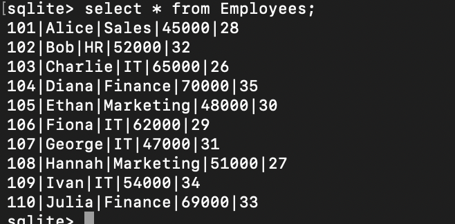
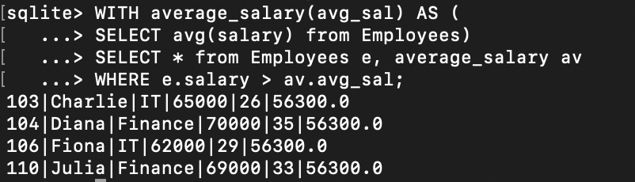
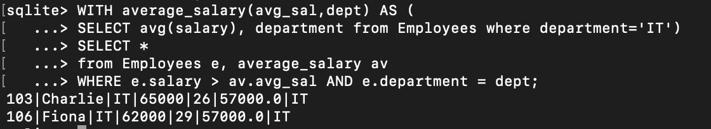
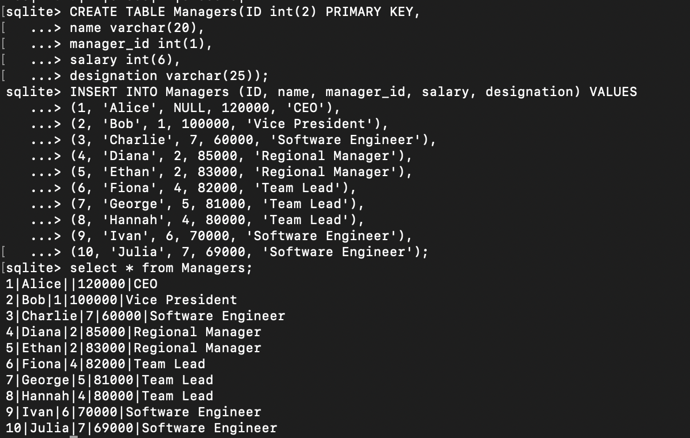
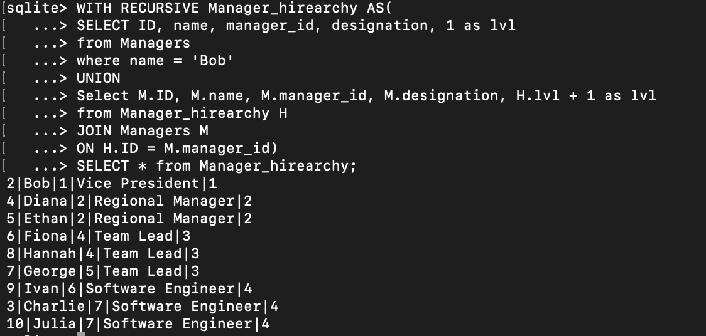

# TASK 8: Common Table Expressions (CTEs) and Recursive Queries

## a) Write a non-recursive CTE to structure a multi-step query for readability (e.g., breaking down a complex aggregation).

### Employee Table:



### Query:

```
WITH average_salary(avg_sal) AS (
SELECT avg(salary) from Employees)
SELECT * from Employees e, average_salary av
WHERE e.salary > av.avg_sal;
```

### Output:



### Query(Example 2):

```
WITH average_salary(avg_sal,dept) AS (
SELECT avg(salary), department from Employees where department='IT')
SELECT *
from Employees e, average_salary av
WHERE e.salary > av.avg_sal AND e.department = dept;
```

### Output:



## b) Create a recursive CTE to display hierarchical data (e.g., an organizational chart or a category tree).

## c) Ensure proper termination of the recursive CTE to avoid infinite loops.

### Managers table:

```
CREATE TABLE Managers(ID int(2) PRIMARY KEY,
    name varchar(20),
    manager_id int(1),
    salary int(6),
    designation varchar(25));
```

```
INSERT INTO Managers (ID, name, manager_id, salary, designation) VALUES
(1, 'Alice', NULL, 120000, 'CEO'),
(2, 'Bob', 1, 100000, 'Vice President'),
(3, 'Charlie', 7, 60000, 'Software Engineer'),
(4, 'Diana', 2, 85000, 'Regional Manager'),
(5, 'Ethan', 2, 83000, 'Regional Manager'),
(6, 'Fiona', 4, 82000, 'Team Lead'),
(7, 'George', 5, 81000, 'Team Lead'),
(8, 'Hannah', 4, 80000, 'Team Lead'),
(9, 'Ivan', 6, 70000, 'Software Engineer'),
(10, 'Julia', 7, 69000, 'Software Engineer');
```



### Recursive CTE:

```
WITH RECURSIVE Manager_hirearchy AS(
   SELECT ID, name, manager_id, designation, 1 as lvl
   from Managers
    where name = 'Bob'
    UNION
    Select M.ID, M.name, M.manager_id, M.designation, H.lvl + 1 as lvl
    from Manager_hirearchy H
    JOIN Managers M
    ON H.ID = M.manager_id)  --termination condition
    SELECT * from Manager_hirearchy;
```


