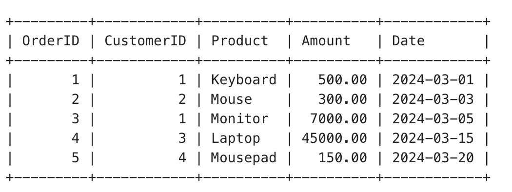
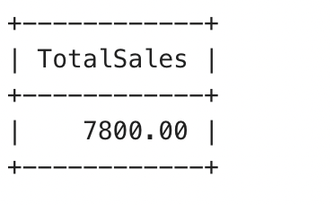
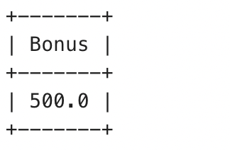

# TASK 9: Stored Procedures and User-Defined Functions

## a) Create a stored procedure that accepts parameters (e.g., a date range) and returns a result set (such as total sales within that range).

### Orders table:

```
CREATE TABLE Orders (
    OrderID INT PRIMARY KEY AUTO_INCREMENT,
    CustomerID INT,
    Product VARCHAR(50),
    Amount DECIMAL(10,2),
    Date DATE
);
```

```
INSERT INTO Orders (CustomerID, Product, Amount, Date) VALUES
(1, 'Keyboard', 500.00, '2024-03-01'),
(2, 'Mouse', 300.00, '2024-03-03'),
(1, 'Monitor', 7000.00, '2024-03-05'),
(3, 'Laptop', 45000.00, '2024-03-15'),
(4, 'Mousepad', 150.00, '2024-03-20');
```

### Table layout:



### Procedure:

```
DELIMITER //

CREATE PROCEDURE GetTotalSales(
    IN StartDate DATE,
    IN EndDate DATE
)
BEGIN
    SELECT SUM(Amount) AS TotalSales
    FROM Orders
    WHERE Date BETWEEN StartDate AND EndDate;
END //

DELIMITER ;
```

```
CALL GetTotalSales('2024-03-01', '2024-03-10');
```



### Function:

```
DELIMITER //
CREATE FUNCTION CalculateBonus(amount INT)
RETURNS INT
DETERMINISTIC
BEGIN
    DECLARE bonus INT;
    SET bonus = amount * 0.1;
    RETURN bonus;
END //

DELIMITER ;
```

```
SELECT CalculateBonus(5000);
```


